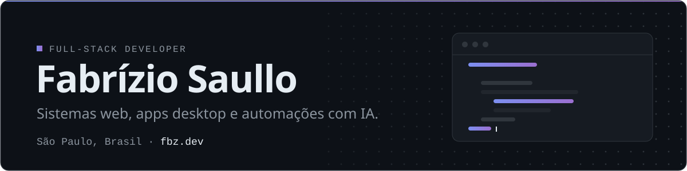
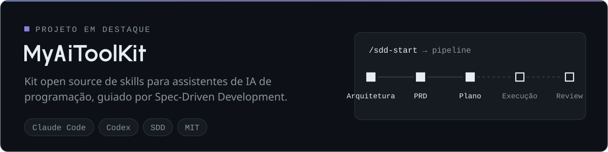
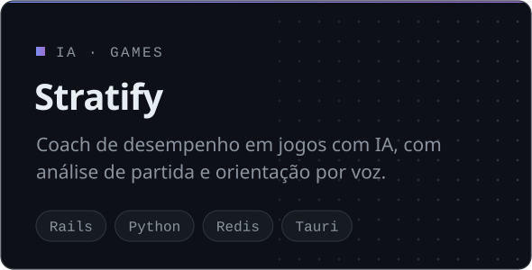
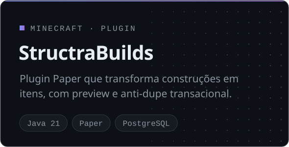
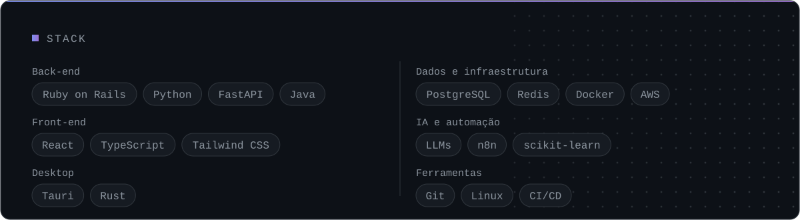

<a href="https://fbz.dev">
  <picture>
    <source media="(prefers-color-scheme: dark)" srcset="assets/header-dark.svg" />
    <source media="(prefers-color-scheme: light)" srcset="assets/header-light.svg" />
    
  </picture>
</a>

 

<a href="https://github.com/fbzsaullo/MyAiToolKit">
  <picture>
    <source media="(prefers-color-scheme: dark)" srcset="assets/myaitoolkit-dark.svg" />
    <source media="(prefers-color-scheme: light)" srcset="assets/myaitoolkit-light.svg" />
    
  </picture>
</a>

  <a href="https://github.com/fbzsaullo?tab=repositories&q=stratify">
    <picture>
      <source media="(prefers-color-scheme: dark)" srcset="assets/stratify-dark.svg" />
      <source media="(prefers-color-scheme: light)" srcset="assets/stratify-light.svg" />
      
    </picture>
  </a>
  <a href="https://github.com/fbzsaullo/StructraBuilds">
    <picture>
      <source media="(prefers-color-scheme: dark)" srcset="assets/structrabuilds-dark.svg" />
      <source media="(prefers-color-scheme: light)" srcset="assets/structrabuilds-light.svg" />
      
    </picture>
  </a>

<picture>
  <source media="(prefers-color-scheme: dark)" srcset="assets/stack-dark.svg" />
  <source media="(prefers-color-scheme: light)" srcset="assets/stack-light.svg" />
  
</picture>

 

  
  
  

